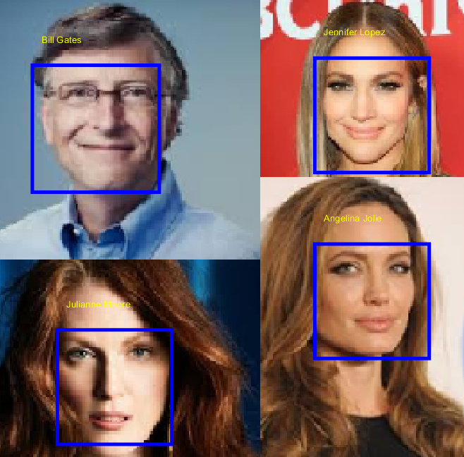

# Face ID



## What is it and how does this work?

Detect, recognize and verify faces using hybrid features: “deep” features from VGG-net + HoG + LBP.
Uses VGG Face matconvnet for deep feature extraction along with features obtained from traditional methods HoG and LBP. Hybrid Features help increase accuracy of recognition to a significant level.

### Detection
Can detect most faces. (Warning may have bias towards the data we trained it with)

### Recognition and Verification
Can recognize and verify the following faces:

1. Abdullah Gul
2. Amelie Mauresmo
3. Andy Roddick
4. Angelina Jolie
5. Atal Bihari
6. Bill Gates
7. Bill Simon
8. Britney Spears
9. Carlos Menem
10. Carlos Moya
11. David Nalbandian
12. Dick Cheney
13. Dominique de
14. Eduardo Duhalde
15. Fidel Castro
16. George Robertson
17. Halle Berry
18. Hamid Karzai
19. Hillary Clinton
20. Hu Jintao
21. Igor Ivanov
22. James Blake
23. Jean Charest
24. Jennifer Aniston
25. Jennifer Lopez
26. Jeremy Greenstock
27. Jiang Zemin
28. John Bolton
29. John Howard
30. John Kerry
31. John Snow
32. Joschka Fischer
33. Jose Maria
34. Julianne Moore
35. Julie Gerberding

### Can it detect mine?

Yes...! All that's requires is a few images of yours. More images = More Accurate verification

## Marker Help Information

This mini-project was submitted for Image and Vision Computing Assignment

### Files for marking

```
Assignment_1.m:
	Part 1: Face Detection

Assignment_2.m: 
	Part 2: Face Recognition and Verification

bonus.m:
	Bonus marks: Linked detector and recogniser, indentifies multiple individuals (drawn from validation dataset which the model has not seen before) correctly.
```

### Dev Files

We split Assignment_2.m into two files for developmental convenience

```
Assignment_2_Part1.m: 
	Face Recognition

Assignment_2_Part2.m: 
	Face Verification
```

VGG Face model Location: ./library/matconvnet/data/models/vgg-face.mat

### Demo Files

We made separate files for demo which loads the trained models

```
Assignment_1_eval.m: 
	Face Detection
	Loads model from ./face_detector.mat

Assignment_2_Part1_eval.m: 
	Face Recognition
	Loads model from ./models/fr_model.mat

Assignment_2_Part2_eval.m: 
	Face Verification
	Loads models from ./models/fv_model.mat
```